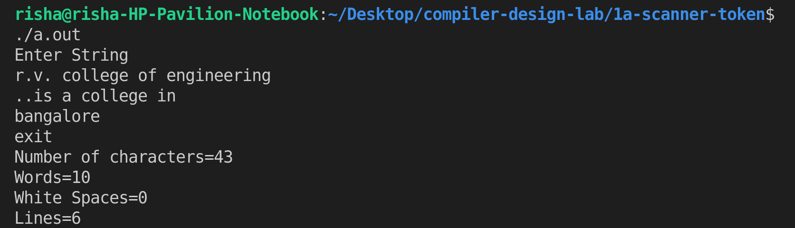

# Experiment 1 (a)
## Writing a scanner- A Scanner should create a token stream from the source code.

- **Step 1-** Write down the regular expression for recognising characters, words, white spaces,lines etc.
- **Step 2-** Declare the variables.
- **Step 3-** Write down the necessary auxiliary functions.

## Output

