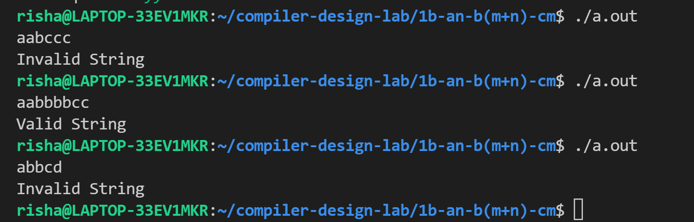

# Experiment 1 (b)

## Write a YACC program to recognize strings of the given form i.e a^n b^(n+m) c^m [n,m>=0]

- **Step 1-** Write the Lex Part to identify the Tokens
- **Step 2-** Declare the variables
- **Step 3-** Write a CFG to generate the strings of the form given and convert it to a YACC program
- **Step 4-** Write down the Auxiliary procedures

## Output

