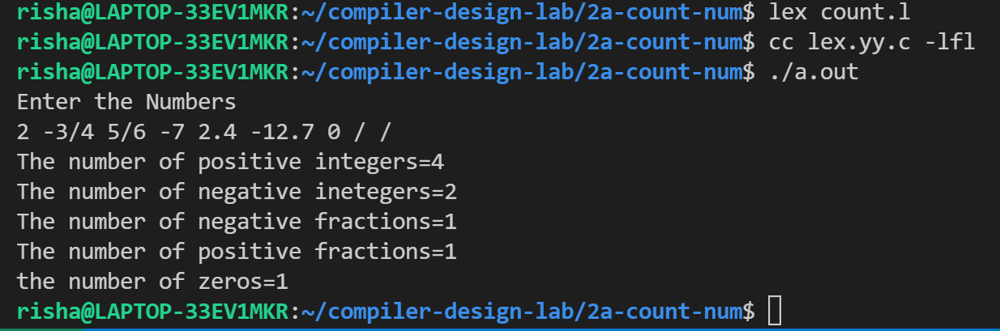

# Experiment 2 (a)

## Write a LEX program to count number of Positive & negative integers and Positive & negative fractions

- **Step 1-** Write down the regular expression for Positive & negative integers and Positive & negative fractions (for eg. Fractions may include 2.3 or 2/3 with combinations of –ve and +ve signs)
- **Step 2-** Declare the variables.
- **Step 3-** Convert the expression into a lex program with the translation rules.
- **Step 4-** Write down the auxiliary functions.

## Output

