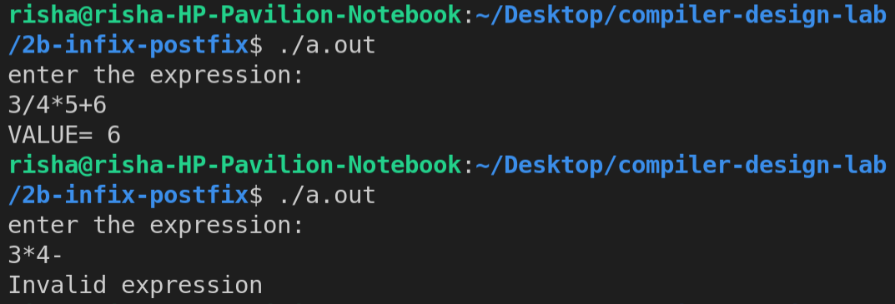

# Experiment 2 (b)

## Write a YACC program to validate and evaluate a simple expression involving operators +,- , * and /.

- **Step 1-** Write the Lex Part identify to identify numbers or characters as operands and operators.
- **Step 2-** Declare the variables.
- **Step 3-** Write and Convert the CFG to YACC program.
- **Step 4-** Write down the Auxiliary procedures.

## Output

