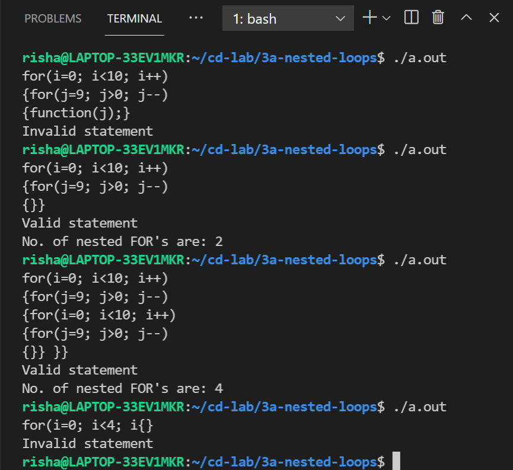

# Experiment 3 (a)

## Write a Parser program to recognize a nested (minimum 3 levels) FOR loop statement for C language.

- **Step 1-** Write a LEX program having the regular expressions to recognize keyword FOR,different operators,parenthesis, numbers etc. Consider simple expressions inside the for loop.
- **Step 2-** Declare the variables.
- **Step 3-** Write down a CFG using the generated tokens in the lex file and convert the grammar into a YACC program.
- **Step 4-** Write down the Auxiliary procedures.

## Output

