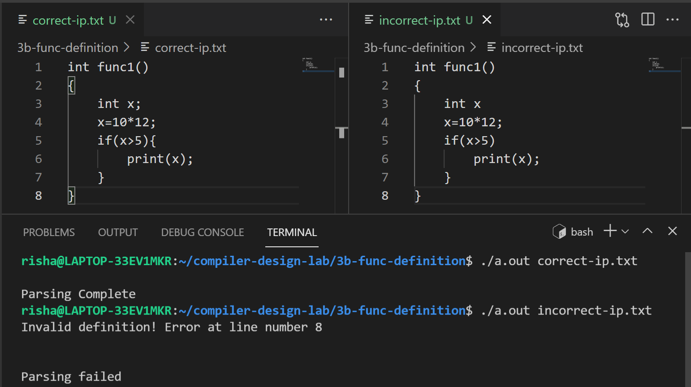

# Experiment 3 (b)

## Write a YACC program that identifies Function Definition of C language

- **Step 1-** Write the Lex Part identify to identify the keywords and variables.
- **Step 2-** Declare the variables.
- **Step 3-** Write and Convert the CFG to YACC program to identify function definition.
- **Step 4-** Write down the Auxiliary procedures.

## Output

