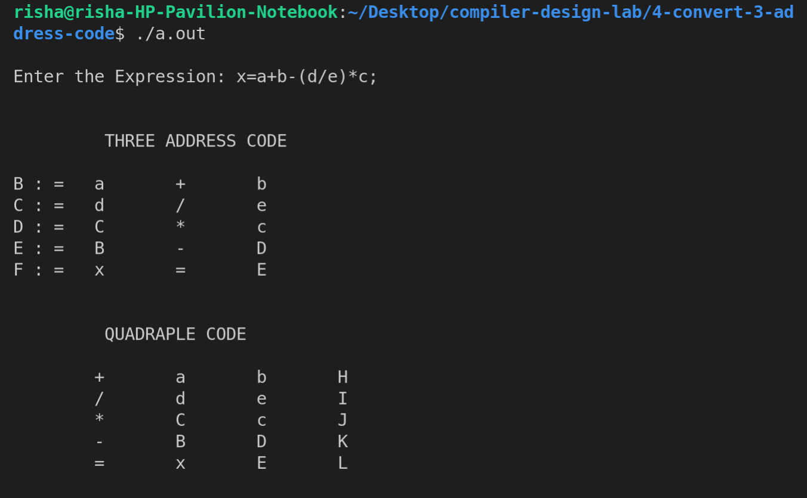
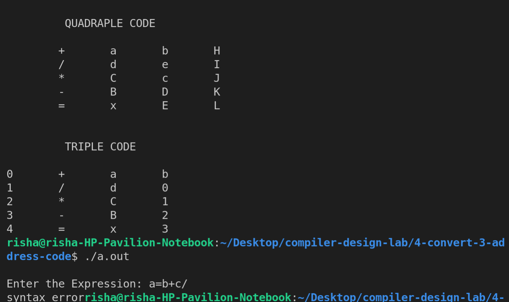

# Experiment 4

## Translation of the language constructs to an intermediate form (e.g. three-address code)

Write a YACC program that reads the C statements from an input file and converts them into three address code representation.

- **Step 1-** Write the Lex Part identify to identify the characters and numbers.
- **Step 2-** Write a Yacc file to convert the expression into Quadruple, Triple and Three address code representation

## Output

