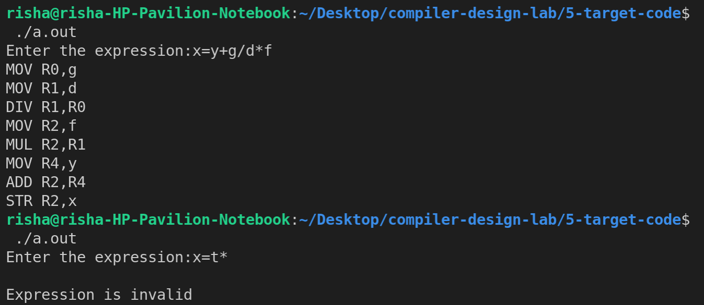

# Experiment 5

## Generation of target code (in assembly language) using compiler construction tools.

- **Step 1-** Write a program to generate the assembly code for the given source code.

## Output

