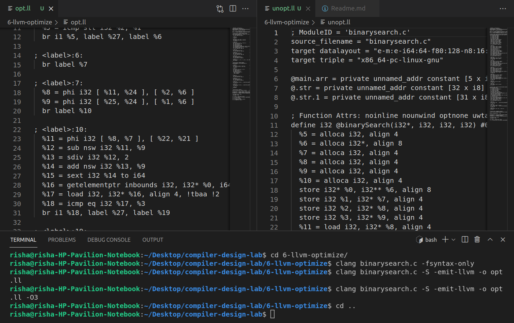

# Experiment 6

## Code improvement and optimization using LLVM compiler.

- **Step 1-** Take the source code of Binary Search sort in C language program (or any searching algorithm).
- **Step 2-** Run it through LLVM Compiler.
- **Step 3-** Print the unoptimized assembly code.
- **Step 4-** Apply optimization techniques and print the optimized assembly code.
- **Step 5-** Justify the optimized code.

## Steps to Run

``` C
$clang --help // not required
$clang binarysearch.c -fsyntax-only
$clang binarysearch.c -S -emit-llvm -o <filename.ll> //unoptimized code in a .ll file
$clang binarysearch-opt.c -S -emit-llvm -o <filename.ll> -O3 //optimized code in a .ll file
```


## About the code:

- `-S` : Run the previous stages as well as LLVM generation and optimization stages and target-specific code generation, producing an assembly file.
- `-emit-llvm` : Generate output files in LLVM formats, suitable for link time optimization. When used with -S this generates LLVM intermediate language assembly files, otherwise this generates LLVM bitcode format object files (which may be passed to the linker depending on the stage selection options).
- `-o <filename.ll>` : To store the intermediate language assembly code in the given filename.
- `-O3` : Optimization level. Like -O2 (Moderate level of optimization which enables most optimizations.), except that it enables optimizations that take longer to perform or that may generate larger code (in an attempt to make the program run faster).


## Output

