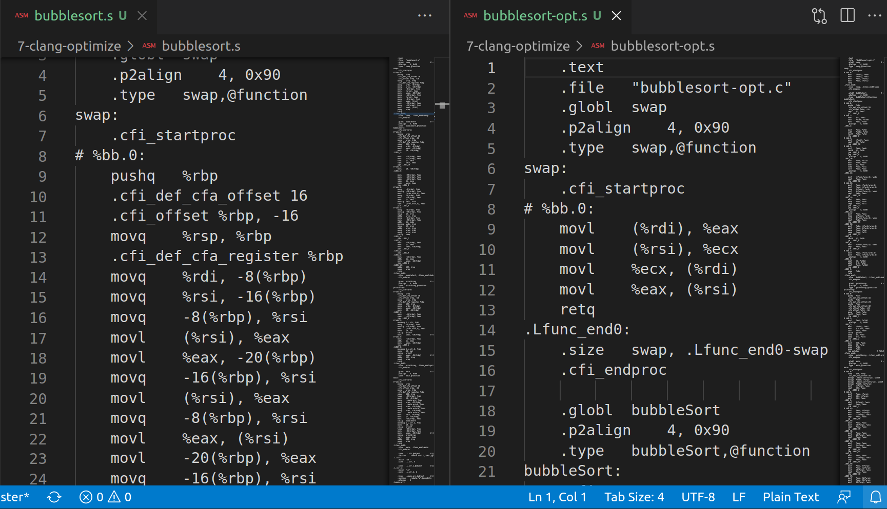

# Experiment 7

## Code improvement and optimization using CLANG compiler.

- **Step 1-** Take the source code of Binary Search sort in C language program (or any searching algorithm).
- **Step 2-** Run it through CLANG Compiler.
- **Step 3-** Print the unoptimized assembly code.
- **Step 4-** Apply optimization techniques and print the optimized assembly code.
- **Step 5-** Justify the optimized code.

## Steps to Run

``` C
$clang --help
$clang bubblesort.c -fsyntax-only
$clang bubblesort.c -S -emit-llvm-o //unoptimized code in a .s file
$clang bubblesort-opt.c -S -emit-llvm-o -O3 //optimized code in a .s file
$clang bubblesort.c -S -O3 -o //output native machine code
```

## Output

