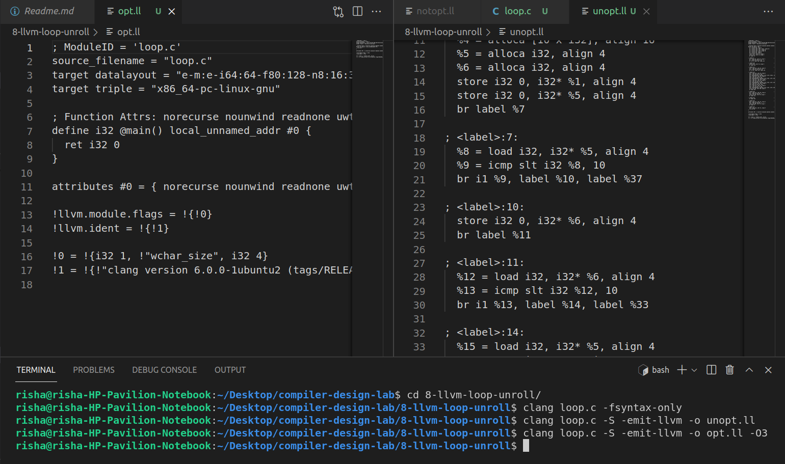

# Experiment 8

## Loop Unrolling using LLVM Compiler
For the given loop apply loop unrolling optimization technique in LLVM and write
down the output in assembly code.
``` C
for (i=0; i<N; i++)
for(j=0;j<N; j++)
c[i]=a[i,j] * b[i];
```

## Steps to Run

``` C
$clang --help // not required
$clang loop.c -fsyntax-only
$clang loop.c -S -emit-llvm -o <filename.ll> //unoptimized code in a .ll file
$clang loop-opt.c -S -emit-llvm -o <filename.ll> -O3 //optimized code in a .ll file
```


## About the code:

- `-S` : Run the previous stages as well as LLVM generation and optimization stages and target-specific code generation, producing an assembly file.
- `-emit-llvm` : Generate output files in LLVM formats, suitable for link time optimization. When used with -S this generates LLVM intermediate language assembly files, otherwise this generates LLVM bitcode format object files (which may be passed to the linker depending on the stage selection options).
- `-o <filename.ll>` : To store the intermediate language assembly code in the given filename.
- `-O3` : Optimization level. Like -O2 (Moderate level of optimization which enables most optimizations.), except that it enables optimizations that take longer to perform or that may generate larger code (in an attempt to make the program run faster).


## Output

